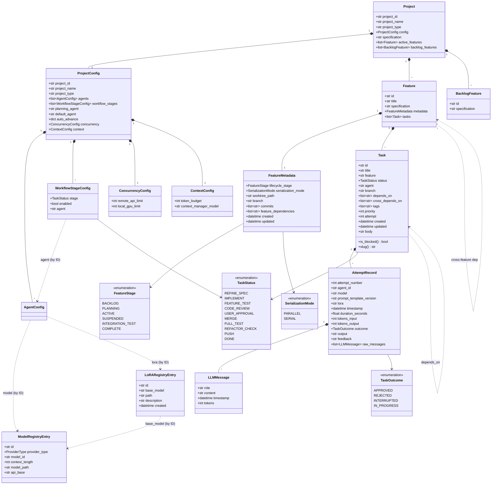
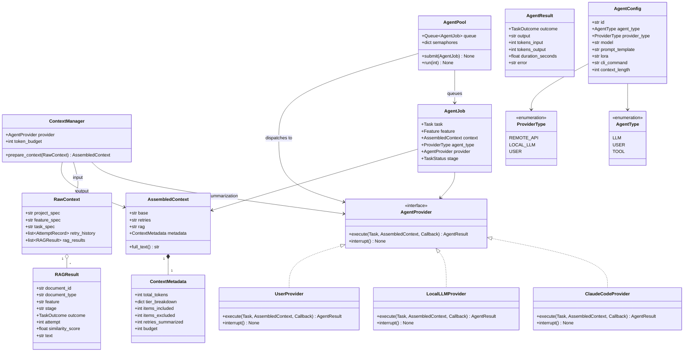
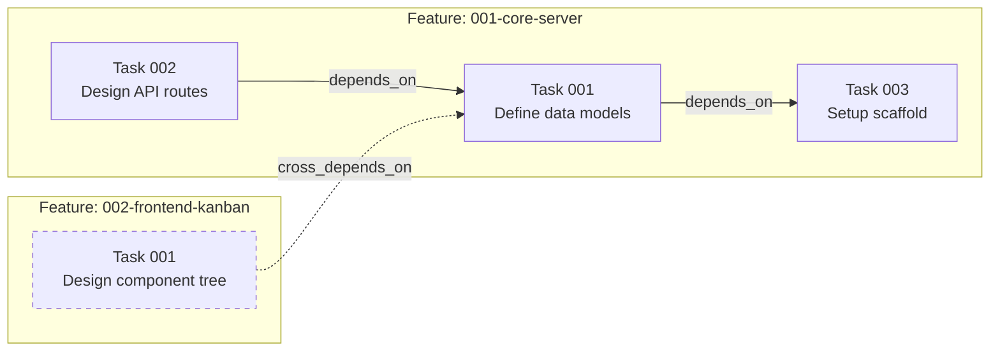
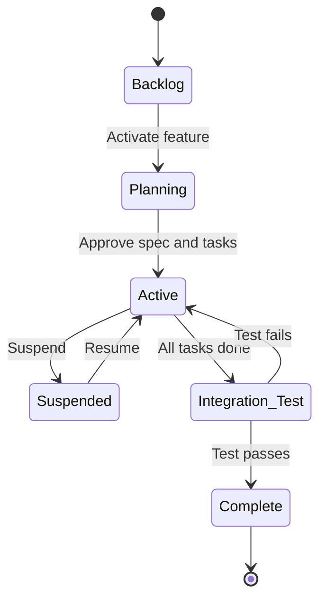
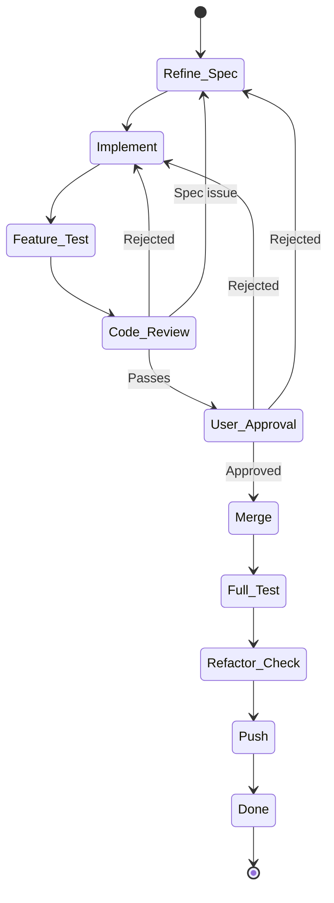
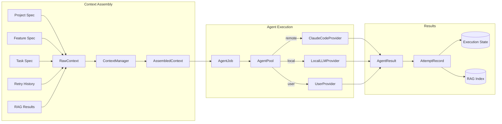

# PCT — Object Model v0.1 (Draft)

---

## 1. Overview

This document defines the core data structures, their relationships, state machines, and storage mappings for PCT. All models are schema-level Pydantic definitions — detailed enough to be unambiguous, but the actual implementation classes will be the source of truth once coding begins.

**Conventions:**
- All config/metadata files use YAML (parsed by PyYAML)
- Task files use YAML frontmatter + Markdown body (parsed by python-frontmatter)
- Streaming logs use JSONL (append-only)
- All timestamps are ISO 8601 UTC
- IDs use numbered prefixes for ordering (e.g., `001-core-server`)

---

## 2. Enums

```python
class FeatureStage(str, Enum):
    """Feature lifecycle stages."""
    BACKLOG = "backlog"
    PLANNING = "planning"
    ACTIVE = "active"
    SUSPENDED = "suspended"
    INTEGRATION_TEST = "integration-test"
    COMPLETE = "complete"

class TaskStatus(str, Enum):
    """Task workflow stages (Kanban columns)."""
    REFINE_SPEC = "refine-spec"
    IMPLEMENT = "implement"
    FEATURE_TEST = "feature-test"
    CODE_REVIEW = "code-review"
    USER_APPROVAL = "user-approval"
    MERGE = "merge"
    FULL_TEST = "full-test"
    REFACTOR_CHECK = "refactor-check"
    PUSH = "push"
    DONE = "done"

class AgentType(str, Enum):
    """Types of agents that can execute tasks."""
    LLM = "llm"
    USER = "user"
    TOOL = "tool"          # future

class ProviderType(str, Enum):
    """Agent execution backend."""
    REMOTE_API = "remote"   # Claude Code CLI, other remote APIs
    LOCAL_LLM = "local"     # llama-cpp-python
    USER = "user"           # manual human execution

class TaskOutcome(str, Enum):
    """Result of a task execution attempt."""
    APPROVED = "approved"
    REJECTED = "rejected"
    INTERRUPTED = "interrupted"
    IN_PROGRESS = "in-progress"

class SerializationMode(str, Enum):
    """Whether tasks in a feature can execute in parallel."""
    PARALLEL = "parallel"   # mergeable outputs, concurrent execution allowed
    SERIAL = "serial"       # non-mergeable outputs, one task at a time

class AuthProvider(str, Enum):
    """How a user authenticated."""
    LOCAL = "local"         # email + password
    GOOGLE = "google"       # Google OAuth
```

---

## 3. Core Domain Models

### Project

The top-level entity. One PCT instance per project. Not directly persisted as a single object — it's assembled from `pct.yaml`, `project_spec.md`, and the feature/task directory structure.

```python
class Project(BaseModel):
    """Assembled at runtime from .pct/ directory contents."""
    project_id: str
    project_name: str
    project_type: str                          # "code", "content", "creative", etc.
    config: ProjectConfig                      # from pct.yaml
    specification: str                         # from project_spec.md (raw markdown)
    active_features: list[Feature]             # from active-features/
    backlog_features: list[BacklogFeature]     # from feature_backlog/
```

### ProjectConfig

Maps directly to `pct.yaml`. This is the primary persisted configuration.

```python
class ProjectConfig(BaseModel):
    """Persisted as .pct/pct.yaml"""
    project_id: str
    project_name: str
    project_type: str
    agents: list[AgentConfig]                  # named agents defined for this project
    workflow_stages: list[WorkflowStageConfig] # ordered list of active stages with agent assignments
    planning_agent: str                        # agent ID for the planning chat
    default_agent: str                         # agent ID fallback for unassigned stages
    auto_advance: dict[str, bool]              # stage -> auto-advance flag
    concurrency: ConcurrencyConfig
    context: ContextConfig

class WorkflowStageConfig(BaseModel):
    """Configuration for a single workflow stage."""
    stage: TaskStatus                          # which stage
    enabled: bool = True                       # whether this stage is active
    agent: str | None = None                   # agent ID assigned to this stage (falls back to default_agent)

class ConcurrencyConfig(BaseModel):
    remote_api_limit: int = 2
    local_gpu_limit: int = 1

class ContextConfig(BaseModel):
    token_budget: int = 8000
    context_manager_model: str = "claude-haiku"
```

### Feature

A major deliverable, represented as a Kanban swimlane. Assembled from `feature_spec.md` + `metadata.yaml` + `tasks/` directory.

```python
class Feature(BaseModel):
    """Assembled from active-features/<nnn>-<name>/ directory."""
    id: str                                    # e.g., "001-core-server"
    title: str
    specification: str                         # from feature_spec.md (raw markdown)
    metadata: FeatureMetadata                  # from metadata.yaml
    tasks: list[Task]                          # from tasks/ directory

class FeatureMetadata(BaseModel):
    """Persisted as active-features/<nnn>-<name>/metadata.yaml"""
    lifecycle_stage: FeatureStage
    serialization_mode: SerializationMode = SerializationMode.PARALLEL
    worktree_path: str | None = None           # active git worktree path
    branch: str | None = None                  # git branch name
    commits: list[str] = []                    # commit SHAs
    feature_dependencies: list[str] = []       # cross-feature deps (feature IDs)
    created: datetime
    updated: datetime

class BacklogFeature(BaseModel):
    """A feature in the backlog — spec only, no tasks or metadata yet."""
    id: str                                    # filename slug
    specification: str                         # from feature_backlog/<name>.md
```

### Task

A single unit of work within a feature. Persisted as a YAML-frontmatter Markdown file.

```python
class Task(BaseModel):
    """Persisted as active-features/<feature>/tasks/<nnn>-<slug>.md

    Frontmatter fields map to this model.
    Markdown body contains the spec, acceptance criteria, and notes.
    """
    # --- Frontmatter fields ---
    id: str                                    # e.g., "001"
    title: str
    feature: str                               # parent feature ID
    status: TaskStatus                         # current workflow stage
    agent: str                                 # agent ID for current stage
    branch: str                                # git branch name
    depends_on: list[str] = []                 # intra-feature task IDs
    cross_depends_on: list[str] = []           # cross-feature: "feature-id/task-id"
    tags: list[str] = []
    priority: int = 0
    attempt: int = 1                           # current attempt number
    created: datetime
    updated: datetime

    # --- Markdown body (not in frontmatter) ---
    body: str                                  # spec + acceptance criteria + notes

    @property
    def is_blocked(self) -> bool:
        """True if any dependency (intra or cross-feature) is unmet."""
        ...

    @property
    def slug(self) -> str:
        """Filename-safe identifier: e.g., '001-define-data-models'"""
        ...
```

### Model Registry

Global catalog of available models. Shared across all projects.

```python
class ModelRegistryEntry(BaseModel):
    """Persisted in ~/.pct/registries/models.yaml (list of entries)."""
    id: str                                    # e.g., "claude-sonnet-4-5", "llama-3-8b"
    provider_type: ProviderType                # remote or local
    model_id: str                              # provider-specific identifier (API model ID or local filename)
    context_length: int                        # max tokens
    model_path: str | None = None              # for local models: path to weights file
    api_base: str | None = None                # for remote models: API endpoint base URL
```

### LoRA Registry

Global catalog of available LoRA adapters. Shared across all projects.

```python
class LoRARegistryEntry(BaseModel):
    """Persisted in ~/.pct/registries/loras.yaml (list of entries)."""
    id: str                                    # e.g., "code-review-v2", "summarizer-v1"
    base_model: str                            # model registry ID — enforces compatibility
    path: str                                  # path to LoRA adapter weights
    description: str = ""
    created: datetime
```

### Agent

Standalone, named configuration that defines an executor. Agents are defined per-project and reference the global Model and LoRA registries.

```python
class AgentConfig(BaseModel):
    """Persisted in .pct/pct.yaml under the agents list."""
    id: str                                    # e.g., "claude-code", "local-reviewer"
    agent_type: AgentType
    provider_type: ProviderType
    model: str                                 # model registry ID (from ModelRegistryEntry.id)
    prompt_template: str | None = None         # prompt template name (resolved from curation)
    lora: str | None = None                    # LoRA registry ID (from LoRARegistryEntry.id)

    # Provider-specific config
    cli_command: str | None = None             # for remote API (e.g., "claude")
    context_length: int | None = None          # override model's default context window
```

### User

A registered PCT user. Persisted as a JSON file. Passwords are bcrypt-hashed; Google OAuth users have no password.

```python
class User(BaseModel):
    """Persisted in ~/.pct/users/users.json (keyed by email).
    Location is configurable via PCT_USER_DATA_DIR env var."""
    email: str
    hashed_password: str                       # bcrypt hash, empty string for OAuth users
    auth_provider: AuthProvider                # "local" or "google"
    created_at: datetime

class TokenResponse(BaseModel):
    """Returned by auth endpoints."""
    access_token: str                          # JWT (HS256), contains {"sub": email, "exp": ...}
    token_type: str = "bearer"
```

**Storage:** `~/.pct/users/users.json` — a flat JSON dict keyed by email. Lives outside the project repo since users are global to the PCT installation. Configurable via `PCT_USER_DATA_DIR`.

**Auth flow:**
- **Local:** Register/login with email + password. Password is bcrypt-hashed before storage. Server returns a JWT.
- **Google:** Frontend obtains a Google ID token, backend verifies it via `google-auth`, creates user if new, returns a JWT.
- **JWT:** HS256-signed, contains `sub` (email) and `exp` (expiry). Validated on protected endpoints via `Authorization: Bearer <token>` header.

---

## 4. Execution Models

Execution models fall into two categories:
- **Ephemeral (in-memory only):** `AgentJob`, `AgentResult`, `RawContext`, `AssembledContext`, `ContextMetadata` — these exist only during execution and are not persisted to disk.
- **Persistent (stored to disk):** `AttemptRecord`, `AttemptMetadata`, `LLMMessage` — these are written to the execution state directory after each agent run.

After execution completes, PCT converts the ephemeral `AgentResult` into a persistent `AttemptRecord` by writing `output.md`, `feedback.md`, `metadata.yaml`, and `agent_log.jsonl` to the attempt directory.

### AgentJob

Queued unit of work for the agent concurrency pool. **Ephemeral** — exists in the `AgentPool` queue only.

```python
class AgentJob(BaseModel):
    """Submitted to AgentPool.queue for execution. Not persisted."""
    task: Task
    feature: Feature
    context: AssembledContext
    agent_type: ProviderType                   # determines which semaphore
    provider: AgentProvider                    # the executor (not serialized)
    stage: TaskStatus                          # which workflow stage is executing

    class Config:
        arbitrary_types_allowed = True         # for AgentProvider protocol
```

### AgentResult

Outcome of a single agent execution. **Ephemeral** — converted to a persistent `AttemptRecord` after execution completes.

```python
class AgentResult(BaseModel):
    """Returned by AgentProvider.execute(). Not persisted directly;
    PCT converts this to AttemptRecord files after execution."""
    outcome: TaskOutcome
    output: str                                # agent's produced content
    tokens_input: int = 0
    tokens_output: int = 0
    duration_seconds: float = 0.0
    error: str | None = None                   # if execution failed
```

### AttemptRecord

Full record of a single execution attempt. Assembled from files in the execution directory.

```python
class AttemptRecord(BaseModel):
    """Assembled from execution/active-tasks/<task-id>/attempt-<nnn>/

    Files:
      agent_log.jsonl  -> raw_messages
      output.md        -> output
      feedback.md      -> feedback
      metadata.yaml    -> all other fields
    """
    attempt_number: int
    agent_id: str
    model: str
    prompt_template_version: str | None = None
    lora: str | None = None
    timestamp: datetime
    duration_seconds: float
    tokens_input: int
    tokens_output: int
    outcome: TaskOutcome
    output: str                                # agent's produced output
    feedback: str | None = None                # rejection feedback (if rejected)
    raw_messages: list[LLMMessage] = []        # full conversation transcript

class AttemptMetadata(BaseModel):
    """Persisted as attempt-<nnn>/metadata.yaml"""
    attempt_number: int
    agent_id: str
    model: str
    prompt_template_version: str | None = None
    lora: str | None = None
    timestamp: datetime
    duration_seconds: float
    tokens_input: int
    tokens_output: int
    outcome: TaskOutcome
```

### LLMMessage

Single message in an LLM conversation.

```python
class LLMMessage(BaseModel):
    """Single entry in agent_log.jsonl"""
    role: Literal["system", "user", "assistant"]
    content: str
    timestamp: datetime
    tokens: int | None = None
```

---

## 5. Context Models

### RawContext

All gathered context materials before the Context Manager processes them. **Ephemeral** — assembled in-memory from persisted specs, attempt records, and RAG results.

```python
class RawContext(BaseModel):
    """Input to ContextManager.prepare_context(). Not persisted."""
    project_spec: str                          # full project_spec.md content
    feature_spec: str                          # full feature_spec.md content
    task_spec: str                             # full task .md body
    retry_history: list[AttemptRecord]         # all prior attempts for this task
    rag_results: list[RAGResult]               # retrieved similar documents
```

### AssembledContext

Final context passed to an agent after Context Manager compression. **Ephemeral** — exists in-memory during execution. The context inspector UI (F3) reads this before the agent runs.

```python
class AssembledContext(BaseModel):
    """Output of ContextManager.prepare_context(). Not persisted.
    Passed to AgentProvider.execute()."""
    base: str                                  # tier 1: specs (always verbatim)
    retries: str                               # tier 2: retry history (summarized)
    rag: str                                   # tier 3: RAG results (ranked/compressed)
    metadata: ContextMetadata

    @property
    def full_text(self) -> str:
        return f"{self.base}\n\n{self.retries}\n\n{self.rag}"

class ContextMetadata(BaseModel):
    """Metadata about the assembled context for the inspector UI. Not persisted."""
    total_tokens: int
    tier_breakdown: dict[str, int]             # {"base": 2000, "retries": 1500, "rag": 3000}
    items_included: int                        # number of RAG results included
    items_excluded: int                        # number of RAG results dropped
    retries_summarized: int                    # number of old attempts summarized
    budget: int                                # configured token budget
```

### RAGResult

Single retrieval result from LanceDB.

```python
class RAGResult(BaseModel):
    """Returned by RAG query. Maps to TaskDocument/SpecDocument in LanceDB."""
    document_id: str
    document_type: Literal["task", "spec", "feature"]
    feature: str | None = None
    stage: str | None = None
    outcome: TaskOutcome | None = None
    attempt: int | None = None
    similarity_score: float
    text: str                                  # the retrieved content
```

---

## 6. RAG Storage Models

LanceDB models for vector search. These extend `LanceModel` (which extends Pydantic `BaseModel`).

```python
from lancedb.pydantic import Vector, LanceModel

class TaskDocument(LanceModel):
    """Indexed in ~/.pct/projects/<id>/rag/tasks.lance/"""
    task_id: str
    feature: str
    stage: str
    outcome: str                               # "approved" | "rejected"
    attempt: int
    text: str                                  # content to embed and search
    vector: Vector(384)                        # all-MiniLM-L6-v2 output dimension

class SpecDocument(LanceModel):
    """Indexed in ~/.pct/projects/<id>/rag/specs.lance/"""
    spec_id: str
    spec_type: Literal["project", "feature", "task"]
    feature: str | None = None
    text: str
    vector: Vector(384)
```

---

## 7. Protocol Interfaces

### AgentProvider

The core abstraction for all agent backends. All providers implement this protocol.

```python
class AgentProvider(Protocol):
    async def execute(
        self,
        task: Task,
        context: AssembledContext,
        on_output: Callable[[str], Awaitable[None]],   # streaming callback
    ) -> AgentResult: ...

    async def interrupt(self) -> None: ...
```

**Implementations:**

| Provider | Backend | Notes |
|----------|---------|-------|
| `ClaudeCodeProvider` | Claude Code CLI via subprocess | Primary. Streams stdout/stderr. Interrupt via SIGTERM. |
| `LocalLLMProvider` | llama-cpp-python | Separate process/thread pool. Same streaming interface. |
| `UserProvider` | Manual human execution | No subprocess. Presents task in UI, waits for completion. |
| `ContextManagerProvider` | Configurable LLM (lightweight) | Specialized for summarization. Called pre-execution and as agent tool. |

---

## 8. State Machines

### Feature Lifecycle

```
                    ┌──────────────────────────────────┐
                    │                                  │
                    v                                  │
  Backlog ──> Planning ──> Active ──> Integration Test ──> Complete
                            │  ^          │
                            │  │          │ (failure spawns
                            v  │          │  new tasks)
                         Suspended ───────┘
```

**Valid transitions:**

| From | To | Trigger |
|------|----|---------|
| Backlog | Planning | User activates feature |
| Planning | Active | User approves spec and task breakdown |
| Active | Suspended | User clicks "Suspend" |
| Suspended | Active | User resumes (after re-planning + impact analysis) |
| Active | Integration Test | All tasks reach `done` |
| Integration Test | Complete | Integration test passes |
| Integration Test | Active | Integration test fails (new tasks spawned at Refine Spec) |

### Task Workflow

```
  refine-spec ──> implement ──> feature-test ──> code-review ──> user-approval
       ^                                              │               │
       │              (reject / send back)            │               │
       └──────────────────────────────────────────────┘               │
                                                                      v
                                                      merge ──> full-test ──> refactor-check ──> push ──> done
```

**Valid transitions:**

| From | To | Trigger |
|------|----|---------|
| Any stage | Next stage | Agent completes + auto-advance, or user advances manually |
| code-review | implement | Review rejects, sends back with feedback |
| code-review | refine-spec | Review rejects, fundamental spec issue |
| user-approval | Any earlier stage | User rejects, sends back to specific stage |
| Any stage | Any earlier stage | User manually sends back (with confirmation) |
| (new task) | refine-spec | Task added mid-flight by user or agent |

**Blocked state:** A task remains in its current stage if any `depends_on` or `cross_depends_on` dependency is unmet. Blocked tasks are visually indicated on the Kanban board.

---

## 9. Model Relationships

### Domain Model Class Diagram



### Execution Model Class Diagram



### Task Dependency Model

Tasks support two types of dependencies. Both block execution until the dependency reaches `done`.



### Feature Lifecycle



### Task Workflow



### Execution Pipeline



---

## 10. Storage Mapping

### Git-tracked (`.pct/` in project repo)

| Model | File | Format |
|-------|------|--------|
| ProjectConfig | `.pct/pct.yaml` | YAML |
| AgentConfig (list) | `.pct/pct.yaml` (under `agents` key) | YAML |
| WorkflowStageConfig (list) | `.pct/pct.yaml` (under `workflow_stages` key) | YAML |
| Project link | `.pct/link.yaml` | YAML |
| Project spec | `.pct/project_spec.md` | Markdown |
| Feature spec | `.pct/active-features/<id>/feature_spec.md` | Markdown |
| FeatureMetadata | `.pct/active-features/<id>/metadata.yaml` | YAML |
| Task | `.pct/active-features/<id>/tasks/<nnn>-<slug>.md` | YAML frontmatter + Markdown |
| Backlog feature spec | `.pct/feature_backlog/<name>.md` | Markdown |

### Not git-tracked (`~/.pct/projects/<project-id>/`)

| Model | File | Format |
|-------|------|--------|
| Project link (reverse) | `link.yaml` | YAML |
| AttemptMetadata | `execution/active-tasks/<task>/attempt-<nnn>/metadata.yaml` | YAML |
| Attempt output | `execution/active-tasks/<task>/attempt-<nnn>/output.md` | Markdown |
| Attempt feedback | `execution/active-tasks/<task>/attempt-<nnn>/feedback.md` | Markdown |
| LLM transcript | `execution/active-tasks/<task>/attempt-<nnn>/agent_log.jsonl` | JSONL |
| Completed attempts | `execution/completed-tasks/<task>/...` | Same structure |
| Integration test | `execution/features/<feature>/integration-test/attempt-<nnn>/...` | Same structure |
| Planning chat | `chat_history/planning-<nnn>.jsonl` | JSONL |
| RAG: task index | `rag/tasks.lance/` | Lance columnar |
| RAG: spec index | `rag/specs.lance/` | Lance columnar |
| Kanban snapshots | `kanban_snapshots/` | YAML |

### User data (`~/.pct/users/`, configurable via `PCT_USER_DATA_DIR`)

| Model | File | Format |
|-------|------|--------|
| User (all users) | `users.json` | JSON (dict keyed by email) |

### Global registries (`~/.pct/registries/`)

| Model | File | Format |
|-------|------|--------|
| ModelRegistryEntry | `models.yaml` | YAML (list of entries) |
| LoRARegistryEntry | `loras.yaml` | YAML (list of entries) |

### Global curation (`~/.pct/curation/`)

| Model | File | Format |
|-------|------|--------|
| Prompt templates | `prompt_templates/v<N>/<stage>.md` | Markdown |
| Training data | `training_data/{positive,negative}/` | Mixed |
| LoRA weights | `loras/<name>/` | Model files |

### Ephemeral (in-memory only)

| Model | Lifecycle | Notes |
|-------|-----------|-------|
| AgentJob | Created when task is ready for execution, consumed by AgentPool worker | Queued in `asyncio.Queue` |
| AgentResult | Returned by `AgentProvider.execute()`, converted to AttemptRecord | Written to disk as attempt files |
| RawContext | Assembled from persisted specs + attempt records + RAG results | Input to ContextManager |
| AssembledContext | Output of ContextManager, passed to agent | Visible in context inspector UI |
| ContextMetadata | Token counts and tier breakdown for UI display | Part of AssembledContext |
